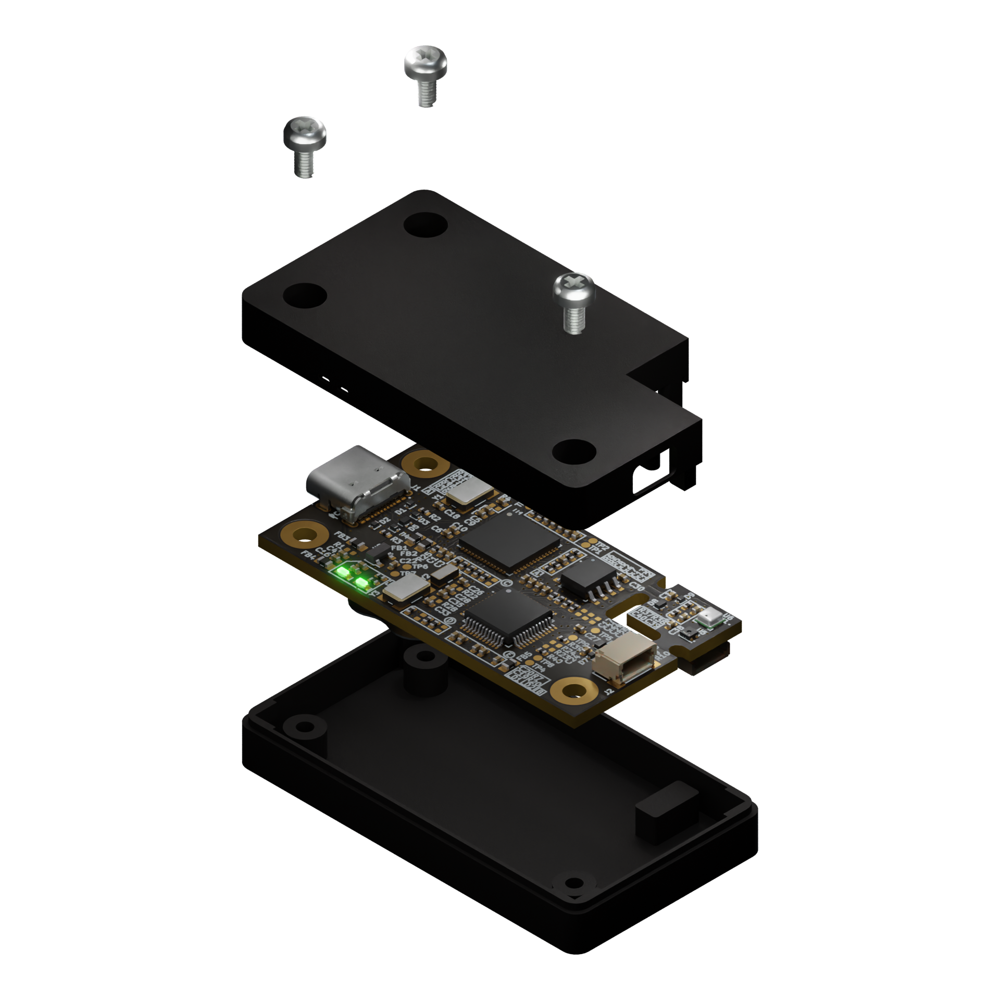

# Environment sensor board enclosure

Copyright (c) 2024 [Antmicro](https://www.antmicro.com)

## Overview

This repository contains open hardware mechanical design files for an enclosure matching the [Environment Sensor](https://github.com/antmicro/environment-sensor) PCBs.
The enclosure has been optimized mechanically for PCBs in revision 1.0.3.
There are two major parts of the enclosure:

* top lid - installed above the board, exposes the sensor island
* bottom lid - installed below the board

The eclosure is designed to be assembled using 3x M2.5 screws.

## Key features

* Dust protection
* Optimized for desktop usage

## Project structure

The main directory contains a LICENSE and a README.
The remaining files are stored in the following directories:

* `step` - contains the enclosure parts published as STEP files 
* `stl` - contains the enclosure parts for 3D printing in STL format
* `blend` - contains enclosure parts in Blender file format
* `img` - contains graphics for this README

## Licensing

This project is published under the [Apache-2.0](LICENSE) license.

